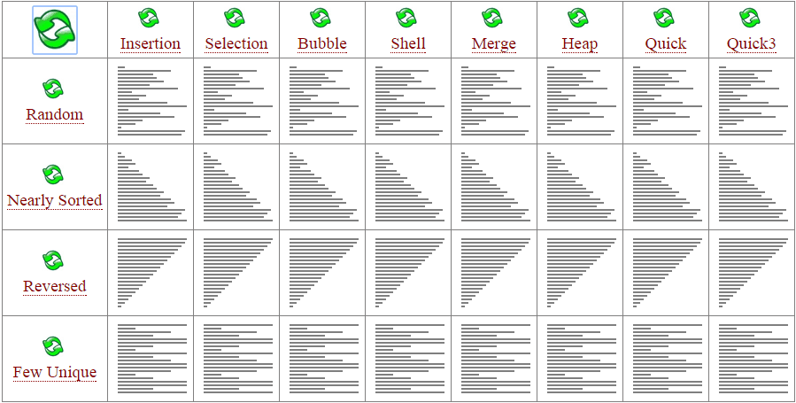

# Sorting Algorithms
Bubble Sort, Selection Sort, Insertion Sort, Merge Sort &amp; Quick Sort
This code helps you to understand the different Sorting algorithms. The sorting algorithms depicted in this code are:

1. Bubble Sort
2. Selection Sort
3. Insertion Sort
4. Quick Sort
5. Merge Sort

### Sourcerer [](https://sourcerer.io/fame/ParthPathak27/ParthPathak27/Sort/links/0)[](https://sourcerer.io/fame/ParthPathak27/ParthPathak27/Sort/links/1)[](https://sourcerer.io/fame/ParthPathak27/ParthPathak27/Sort/links/2)[](https://sourcerer.io/fame/ParthPathak27/ParthPathak27/Sort/links/3)[](https://sourcerer.io/fame/ParthPathak27/ParthPathak27/Sort/links/4)[](https://sourcerer.io/fame/ParthPathak27/ParthPathak27/Sort/links/5)[](https://sourcerer.io/fame/ParthPathak27/ParthPathak27/Sort/links/6)[](https://sourcerer.io/fame/ParthPathak27/ParthPathak27/Sort/links/7)

### Code Requirements
The example code is in Java ([version 1.8](https://java.com/en/download/) or higher will work).

### Description
A sorting algorithm is an algorithm made up of a series of instructions that takes an array as input, performs specified operations on the array, sometimes called a list, and outputs a sorted array. Efficient sorting is important for optimizing the use of other algorithms (such as search and merge algorithms) which require input data to be in sorted lists; it is also often useful for canonicalizing data and for producing human-readable output. More formally, the output must satisfy two conditions:
```
The output is in nondecreasing order.
The output is a permutation (reordering) of the input.
```



```java
switch(ch)
		{
			case 1:
				BinarySort(a,n);
				break;
			case 2:
				SelectionSort(a,n);
				break;
			case 3:
				InsertionSort(a,n);
				break;
			case 4:
				int start=0;
				int end=n-1;
				QuickSort(a,start,end);
				print(a,n);
				break;
			case 5:
				MergeSort(a,n);
				print(a,n);	
				break;
		}
```    
You can select any algorithm from the list and then enter an array which would get sorted through the selected algorithm.

### Execution
To compile the code, simply run the ```javac Sort.java```. To run the code, type ```java Sort```
```
javac Sort.java
java Sort
```
